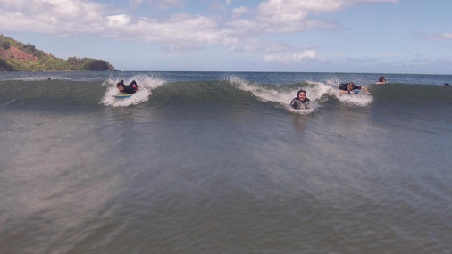
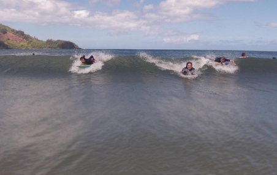

# Seam-Carving

Seam carving is an image-resizing technique that removes one vertical "seam" of pixels at a time.

[Video Demo](https://www.youtube.com/watch?v=9WJvDcoNFzA)

* See `seamcarving.c` for functions to compute the removal of the seam with minimum energy. A *dual energy gradient function* was used to compute energies. In general, two adjacent pixels that are similar in their RGB value have lower energies - these pixels will be removed first.
* `c_img.c` writes RGB values to a .bin file to represent the image.
* `bin_to_png.py` is used to first convert an image to binary. After the images is seam carved, it can be converted back to a .png file with `bin_to_png.py`.

### To use this program to carve your own images:
1. Convert your image from .png format to .bin using `bin_to_png.py`. Go to `bin_to_png.py` and run the these lines of code:
   ```python
    # Write a png image to bin
    image = Image.open("peyto.png")
    write_image(image, "peyto.bin")
    ```
2. You should now see the .bin file in the `Seam-Carving` directory.
3. Determine how many seams (pixels) to remove and specify this number in `main.c`:
    ```c
    #define N_SEAMS 50
    ```
    Also make sure your file name and destination directory are correctly specified.
4. Run `main.c` with `gcc seamcarving.c c_img.c main.c -o main`, then `./main`.
5. Convert the output .bin files back to .png files using `png_to_bin.py`. Change the number of images and the directory of the .bin files (must be the same as where your directory in `main.c`) here:
    ```python
    # Write multiple images from bin to png
    for i in range(55):
        image = read_image("Carved-Images\\img%d.bin" % i)
        image.save("Carved-Images\\img%d.png" % i)
        print(f"i = {i}")

    ```

### Quick Demo
Here are the before and after effects of seamcarving an image of people surfing in the ocean:

**Before**


**After carving 55 seams**


The height of the image did not change, but the width became 55 pixels narrower. We can see that the surfers and mountains in the background did not get removed, but "less important" parts of the image, namely the empty ocean, were carved out. You can see a detailed seam-by-seam progression of the seamcarving process by observing the images in `Carved-Image-Peyto\`, which contains images of Petyo Lake, and `Carved-Images`, which contains this surfing image.